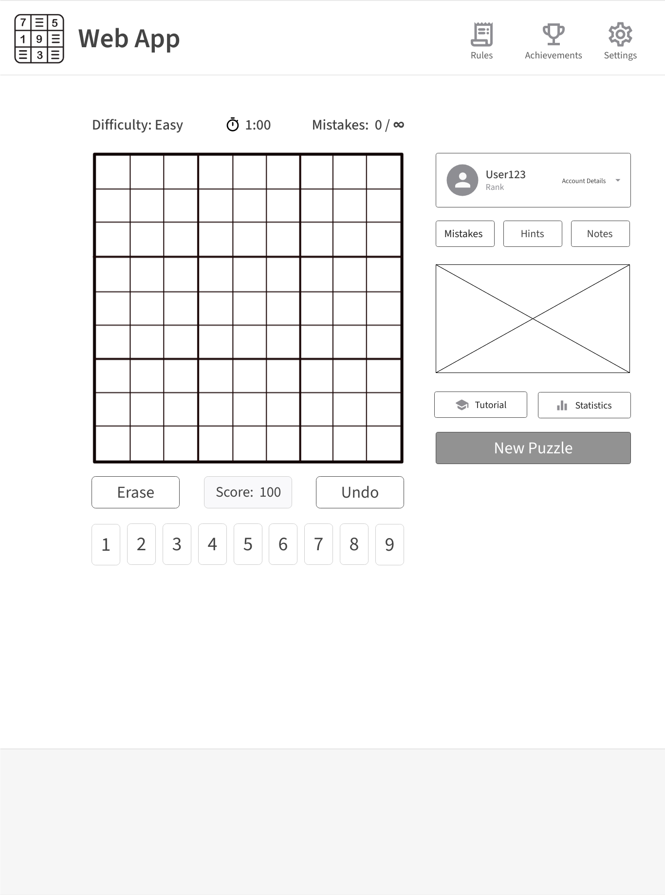
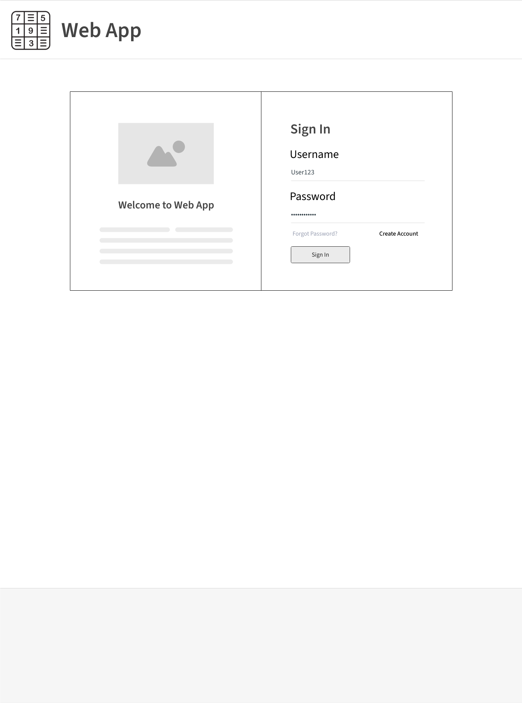
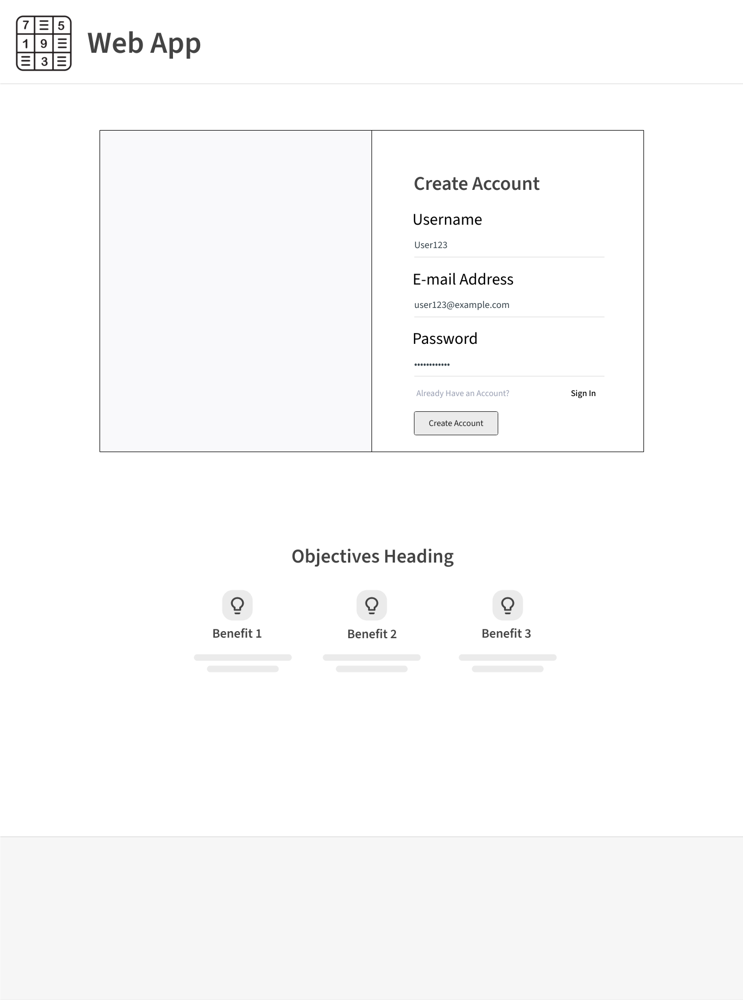
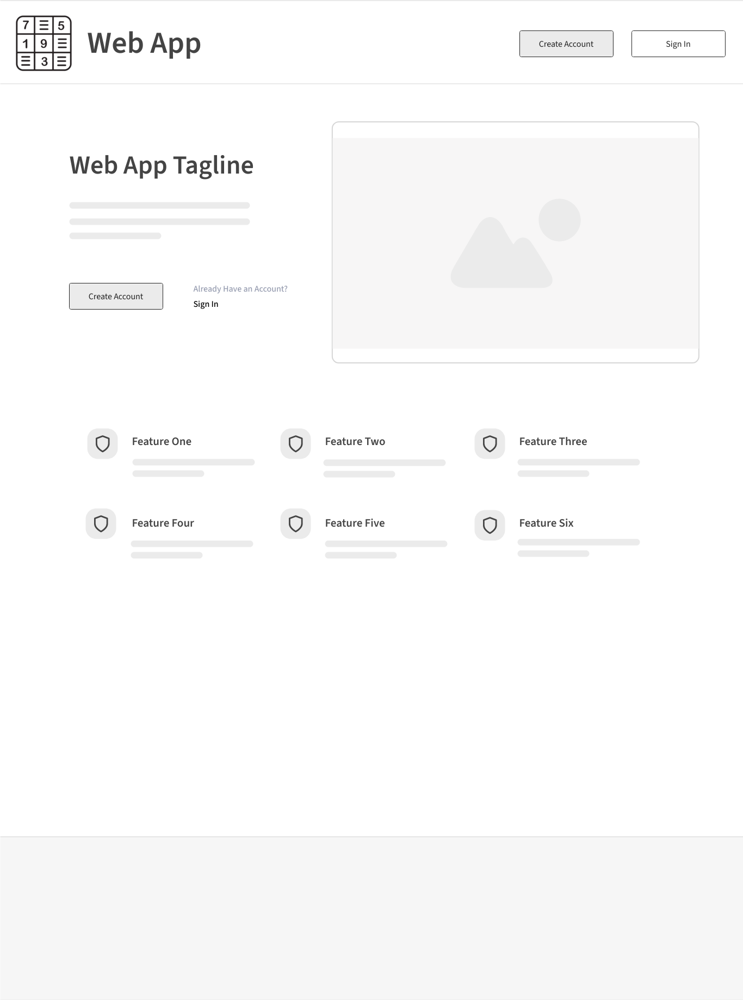
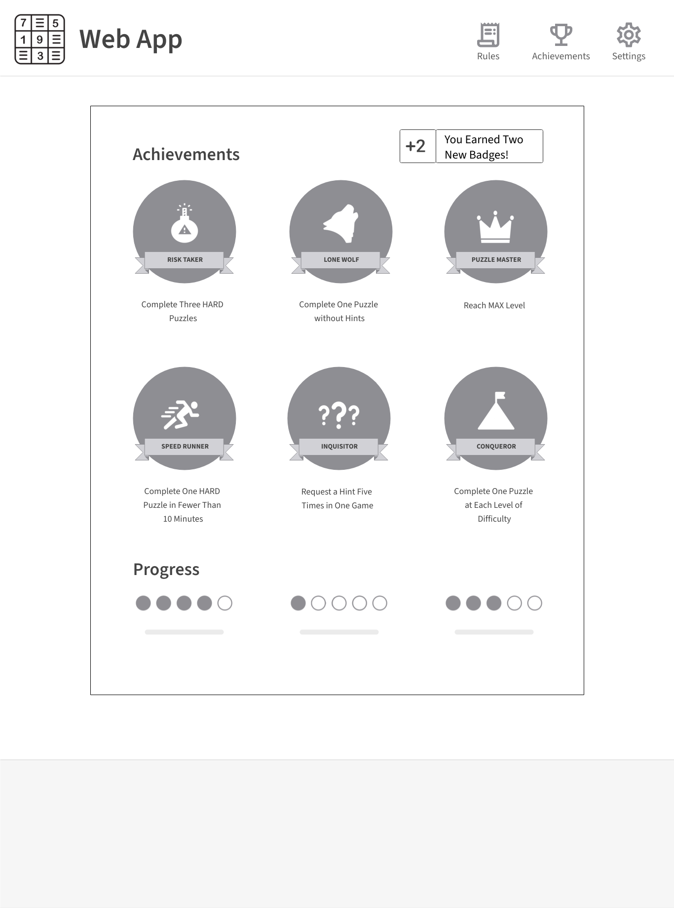

# Project Milestone 4: Web Pages Design 

----------

### Game Page (Matt) ###

* Requirements 

    * Parameters needed for the page
       * Account Info
       * Puzzle Difficulty
       * Setting Selections
       
    * Data needed to render the page
       * Sudoku Data
       * Login Status and/or username
       
    * Link destinations for the page
        * Splash Page (from top left icon)
        * Difficulty Selection Page
        * Rules Page
        * Achievements Page
        * Settings Page
        * Statistics Page
        
    * List of tests for verifying the rendering of the page
        * 9x9 Sudoku empty table displayed
        * Account information displayed if user is signed in
        * Difficulty set to easy if user not signed in, or last setting specified by user account
        * Clicking "Difficulty" should link to Difficulty Setting page
        * "New Puzzle" button clears any input and displays a set of starting values of specified difficulty
        * "Mistakes" button toggles highlighting of incorrect inputs on/off
        * "Hints" button triggers display of a contextual hint based on selected cell
        * "Notes" button toggles entry of notes in cells instead of answers
        * "Erase" button clears all user entry
        * "Undo" button clears last user entry
        * Number buttons enter specified value into a highlighted sudoku cell
        * "Rules" button links to Rules page
        * "Achievments" button links to Achievments page
        * "Settings" button links to settings page
        * Clicking the top-left icon should take you to the Splash Page

-----------

### Login Page (Micah/Ben) ###

* Requirements 

    * Page Description
        * Header with SudokuTutor Logo and Name. 
        * Logo and tagline in left div.
        * User sign-in area.
        * Link to the create account page.

    * Parameters needed for the page
        * WebApp Logo/name/tagline
        * A left-float div containing: 
            -Logo image.
            -h2 level welcome message.
            -Paragraph text describing the application.
        * A right-float Div containing: 
            -h1 "Sign In" text.
            -h2 "Username" text.
            -Username text field.
            -h2 "Password" text field.
            -Password text field (optional: highlighted after a failed login attempt).
            -An embedded "Forgot Password" (left float) div connected with a route to the "Forgot Password" page.
            -An embedded "Create Account" (right float) div with an embedded route to the "Create Account" page.
            -HTML "Sign In" button.
        * An embedded popup message such as: "unsuccessful login attempt, please check your credentials and try again" rendered under the password field after an unsuccessful login.
        * Route for incorrect password field highlighting.
        
    * Data needed to render the page
        * HTML/CSS Templates
            -Sudoku tutor icon.
            -Welcome image.
            -Tagline message.
            -Style for text and divs.
        * Database to verify user accounts.
    
    * Link destinations for the page
        * WebApp upper-left logo returns user to the home page. 
        * Create Account hyperlink text to Create Account page. 
        * Sign in with correct credentials takes user to game page. 
        * Incorrect login attempt refreshes the page with an error message.
        * "Forgot your password" div links to password recovery route (send an email).
    
    * List of tests for verifying the rendering of the page
        * Page appears with the correct formatting and layout, should look like the image.
        * Test that all routes lead to the specified destination pages.
        * Test that appropriate error messages appear on screen when the routes for handling unrecognized username and/or incorrect password are activated.
        * Test that the html and css stylesheet options render correctly when the window size or user's device is changed.

-----------

### Registration Page (Micah/Ben) ###

* Requirements 

    * Page Description
        * Header with SudokuTutor Logo and App name.
        * Create account div with username, email, password fields.
        * Create Account button.
        * Link to sign-in page.
        * Objectives div with three objectives listed.
        
    * Parameters needed for the page
        * Nav-style header with the SudokuTutor logo icon and application title displayed at the top of the page.
        * A centered ~70% page-width parent div container, with two equal-sized child divs (left and right float).
        * Blank left-float child div.
        * Right-float child div containing:
            -h1 "Create Account" text
            -h2 "Username" text
            -Username text field
            -horizontal rule
            -h2 "E-mail Address" text
            -Email address text field
            -horizontal rule
            -h2 "Password" text 
            -Password text field
            -horizontal rule
            -div element with 
                -left-float "Already Have an Account" text. 
                -right-float "Sign-in" div connected to the sign-in page route.
            -HTML "Create Account" button.
    
    * Data needed to render the page
         * HTML/CSS templates.
         * Database of users and associated information.
         * Image files.
         * Icon files.
    
    * Link destinations for the page
        * WebApp upper-left logo returns to homepage.
        * "Already Have An Account?" text links to login page.
        * "sign in Button" redirects to login homepage with user entered credentials.
        * User is directed to the game page if the sign up info is valid.
        * If account exists or does not follow username/email/pw protocol, refreshes the page rendering the appropriate message.
    
    * List of tests for verifying the rendering of the page
        * Page appears with the correct visual formatting and layout. Should look like the image provided.
        * Test that all routes work correctly, and direct the user to the specified page.
        * Test that the html and css stylesheet options render correctly when the window size or user's device is changed.

-----------

### Home Page (Tory/Paul) ###
* Requirements 

    * Page Description
        * Header with the web app logo, name, and navigation links to the Create Account and Sign In pages.
        * Web app tagline and a brief description of the product.
        * Several feature icons with short descriptions.
        * "Create Account" button and "Sign In" link in a prominent location.
        * Footer with contact information.

    *  Parameters needed for the page
        * Web app logo.
        * Web app name.
        * Web app tagline.
        * Product description.
        * Feature icons.
        * Feature descriptions.
        * "Create Account" button/link.
        * "Sign In" button/link.
        * Footer contact information.

    *  Data needed to render the page
        * HTML template and CSS stylesheet. 
        * Web app logo and feature icon image files.
        * Text headings, descriptions.
        * Homepage image file.

    * Link destinations for the page
        * "Create Account" button/link: directs the user to the Create Account Page.
        * "Sign In" button/link: directs the user to the Sign In Page.
        * Web app logo/name: directs the user to the Home Page (i.e., reloads the Home Page).

    * List of tests for verifying the rendering of the page
        * Check that the page loads quickly and all elements are displayed correctly.
        * Check that all links are working and direct users to the correct pages.
        * Check that the web app logo and name are displayed in the header and are hyperlinked to the Home Page.
        * Check that the web app tagline and product description are easy to read and provide accurate information.
        * Check that the feature icons and descriptions are clearly visible and provide accurate information.
        * Check that the "Create Account" button and "Sign In" link are prominently displayed and functional.
        * Check that the contact information in the footer is correct and that any "mailto" links are working properly.
        * Test the page across multiple devices and platforms to verify that it is responsive and that the content is displayed properly.

-----------

### Achievement Page (Tory/Paul) ###

* Requirements 

    * Page Description
        * Header with the web app logo, name, and navigation links to the Create Account and Sign In pages.
        * Rule and settings icons to display a dropdown rule summary and user settings options, respectively.
        * Acheivements icon refreshes the page.
        * Notification Box at the top right of page, detailing the most recent badges earned by user.
        * Six badge icons repesenting earnable achievements.
        * Six badge decriptions detailing what the user needs to accomplish to earn each badge.
        * Progress meter at the bottom of page displaying user advancement towards badge completion.
        * Footer with contact information.

    * Parameters needed for the page
       * Available Badges.
       * Progress Meter.
       * Logo image.
       * User ID/Account info.
    
    * Data needed to render the page
       * Updated User progress on earning indivdual badges.
       * Achievement icons.
       * Header icons (Rules, Achievements, Settings).
       * Text Descriptions of Badges.
       * User information from the database needed to load update achievements.
    
    * Link destinations for the page
        * Home page route, associated with the SudokuTutor icon.
        * Achievement icon reloads page.

    * List of tests for verifying the rendering of the page
        * All possible badges are displayed.
        * Unearned badges are greyed out. 
        * Earned badges are brightened.
        * Progress meter correctly shows how close the user is to earning a particular badge.
        * Clicking the web logo take users back to the "Home" page.
        * Clicking the settings logo takes users to the "Settings" page. 
        * Clicking the rules logo takes user to the "Rules" page.
        * Clicking the achievements logo reloads the current page.
        

-----------
