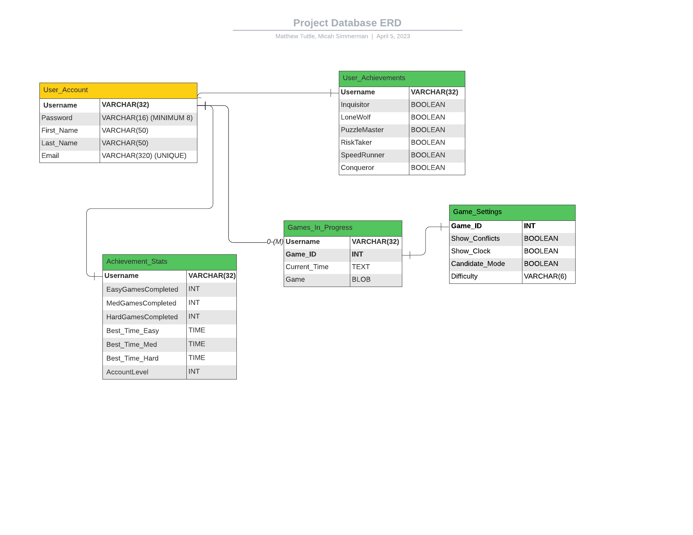

Instructions:

You will create a list of descriptions for tables and functions being created for the project.
You must add a file SQL_TESTING.md to your repository and provide the following for each table (at least 3 tables):

Table Name
Table Description
For each field of the table, provide name and short description.
List of tests for verifying each table
You must also provide the following (in SQL_TESTING.md)for each data access method (at least one access method for each table or query required to get the data to display):

Name
Description
Parameters
return values
List of tests for verifying each access method
Here is a format that can be used for describing each test:

            Use case name
                Verify login with valid user name and password
            Description
                Test the Google login page
            Pre-conditions
                User has valid user name and password
            Test steps
                1. Navigate to login page
                2. Provide valid user name
                3. Provide valid password
                4. Click login button
            Expected result
                User should be able to login
            Actual result
                User is navigated to dashboard with successful login
            Status (Pass/Fail)
                Pass
            Notes
                N/A
            Post-conditions
                User is validated with database and successfully signed into their account.
                The account session details are logged in database. 
                
                
----------------------------------------------------------------------------------------------------------
Potential ERD - https://lucid.app/lucidchart/3d3e38d0-96ce-46d4-a9d2-875a429e5f47/edit?viewport_loc=51%2C-43%2C3072%2C1577%2C0_0&invitationId=inv_8d986d0b-7302-4dbf-a142-bce282110cbb

JoinID:
WGL R4C

 

## User_Account Table ##
### 'User_Account' Table Description ###

    Name: 
        User_Account
    Description:
        User_Account holds user data tuples containing the attributes: 'Username', 'Password', 'First_Name', 'Last_Name', and 'Email'. 
        The User_Account table will be populated via a form submission route associated with the Create Account page.
        Username and Password are stored and verified within this table to grant users access to the rest of the application.
    Field Descriptions:
        Username, VARCHAR(32) - Primary Key
        Password, VARCHAR(16) - NOT NULL
        First_Name, VARCHAR(50) - NOT NULL
        Last_Name, VARCHAR(50) - NOT NULL
        Email, VARCHAR(320) - UNIQUE, NOT NULL
    Tests for Table Verification:
        (see below)
#### 'User_Account' Table Test 1 Description ####

        User_Account Test 1: Create the User_Account table, insert a valid record, verify the insertion.
        Use case name:
            "Create Table / Valid Insert"
        Description:
            Create the User_Account table and insert a valid record. Then retrieve the record(s) to verify the insertion.
        Pre-conditions
            The User_Account table must be created prior to performing the test.
            User_Account table constraints must be in place.
            Inserted data must agree with the table constraints.
        Test steps:
            1. Create the User_Account table (if it does not already exist).
            2. Insert a tuple of valid test data. I.e., following the table constraints given above.
            3. '''SELECT * FROM User_Account''' to view the data and verify that the record has been inserted.
        Expected result:
            The inserted tuple should be clearly visible in the result of the SELECT query.
        Actual result:
            TBD
        Status (Pass/Fail):
            TBD
        Notes:
            Test 
        Post-conditions:
            Tuple exists in the User_Account table.
#### 'User_Account' Table Test 2 Description ####

        User_Account Test 2: Insertion of a record with a duplicate Username.
        Use case name:
            "Duplicate Record Insert"
        Description:
            Inserting a record containing a duplicate Username into the User_Account table should fail.
        Pre-conditions:
            The User_Account table must exist.
            User_Account table constraints must be in place.
            Inserted record must contain a Username that already exists in the User_Account table.
        Test steps:
            1. Ensure that at least one valid tuple is inserted in the User_Account table.
            2. Insert a tuple containing the same Username as one of the valid record(s) from step 1.
            3. Observe the result.
        Expected result:
            An error should occur, citing a violation of the User_Account table primary key constraint on Username.
        Actual result:
            TBD
        Status (Pass/Fail):
            TBD
        Notes:
            Insertion of a duplicate username should be rejected by the database API if the table constraints have been implemented correctly. Observe the API behavior during this insertion and consider this information when developing the User_Account access routes. 
        Post-conditions:
            None.
#### 'User_Account' Table Test 3 Description ####

        User_Account Test 3: Insertion of a record with a duplicate email address.
        Use case name:
            "Existing Email Insert"
        Description:
            Attempting to create an account with an existing email address should fail.
        Pre-conditions:
            The User_Account table must exist, with stated table constraints in place.
            User_Account table should be populated with valid record(s) prior to performing the test.
            Other than the Email parameter, the test record should contain valid user data.
        Test steps:
            1. Create a test record that contains an existing email address. (All other attributes should conform to the User_Account table constraints.)
            2. Insert the record.
            3. Observe the result.
        Expected result:
            An error should occur, citing a violation of the User_Account UNIQUE table constraint on the 'Email' attribute.
        Actual result:
            TBD
        Status (Pass/Fail):
            TBD
        Notes:
            Insertion of a duplicate email should be rejected by the database API if the table constraints have been implemented correctly. Observe the API behavior during this insertion and consider this information when developing the User_Account access routes.
        Post-conditions:
            None.

### 'User_Account' Access Method Descriptions ###

#### Method 1: The 'Create_User_Account' Access Method ####

    Name: 
        'Create_User_Account'
    Description:
        Create_User_Account should insert a tuple filled with new user data into the User_Account table when the user fills in the Create Account form with valid information and clicks the submit button. If the insert is valid with respect to the stated table constraints, the user should be directed to the Login page.
        If the user attempts to create an account with an existing Username or Email, no new record shall be created, and a message should be presented to the user on the same page explaining the error.
    Parameters:
        Username, Password, First_Name, Last_Name, Email, Create Account button
    Return values:  
        User is directed to the Login page if correct information was provided.
        Error message is displayed if Username exists in the table.
        Error message is displayed if Email exists in the table.
    List of tests for verifying the access method: 
        'Create_User_Account' Test 1:
            Use case name:
                "Create Valid Account"
            Description:
                Verify that entering valid form data into the "Create Account" page produces a new record in the User_Account table and redirects the user to the Login page. Inserted data must remain in the table for access by subsequent routes. Entries containing duplicate Username and/or Email should fail to produce a new record and render the initial view along with an appropriate error message.
            Pre-conditions:
                The User_Account table must exist with stated constraints.
                The Username test instance must not exist in User_Account.
                The Email test instance must not exist in User_Account.
                Password, First_Name, and Last_Name must be provided. 
            Test steps:
                1. Navigate to 'Create an Account' page
                2. Provide a unique username (required)
                3. Provide a password (required)
                4. Provide a first name (required)
                5. Provide a last name (required)
                6. Provide a unique email address (required)
                7. Click the 'Create Account' button
                8. Observe the application behavior and monitor any changes to the User_Account table.
                9. Repeat steps 1-8 with a record containing a duplicate Username.
                10. Repeat steps 1-8 with a record containing a duplicate Email.
                11. Repeat steps 1-8 with a record containing a duplicate Username and Email.
            Expected result:
                Steps 1-8: A tuple should appear in the User_Account table containing the new user's data if table constraints were observed. Upon successful account creation, the user should be directed to the 'Login' page.
                Steps 9-11: If the inserted record contains a duplicate Username, Email, or both, then no new record should be inserted into User_Account, and the user should be prompted on the same page to try again (i.e., no redirect).
            Actual result:
                TBD
            Status (Pass/Fail):
                TBD
            Notes:
                Since the user must create an account to possess valid login credentials, it makes sense to perform this test before testing the User_Account interactions with Login page (discussed next). Attempts to add an account under an existing email address and/or Username should fail gracefully and present the user with a message describing the error.
            Post-conditions:
                Valid account records must persist in the User_Account table to provide record access to subsequent routes. 

#### Method 2: The 'User_Login' Access Method ####

    Name: 
        'User_Login'
    Description:
        The User_Login access method should verify that the user's login credentials exist in the User_Account table and, if so, redirect the user to the user's home page. 
        If the provided information is incorrect or does not exist in the User_Account table, the login attempt should fail, and the user should be presented with an error message in place of a redirect.
    Parameters:
        Username, Password, Login Button
    Return values:
        Redirect to Home page if credentials are successfully verified.
        Present an error message if credentials are incorrect and/or do not exist.
    List of tests for verifying each access method: 
        User_Login Test 1:
        Use case name:
            "Test Login"
        Description:
            Verify that a user with valid login credentials is granted access to the rest of the application. 
            Verify that a incorrect and/or non-existent login credentials do NOT provide access to the rest of the application.
        Pre-conditions:
            At least one user must be registered via the 'Create Account' page to provide a set of valid login credentials.
        Test steps:
            1. Navigate to the Login page.
            2. Provide valid user name.
            3. Provide valid password.
            4. Click 'Sign In' button.
            5. Observe the behavior of the application.
            6. Repeat steps 1-5 using an invalid username and correct password.
            7. Repeat steps 1-5 using an invalid password and correct username.
        Expected result:
            Steps 1-5: If a valid Username and Password combination is provided, clicking 'Sign In' button should invoke a redirect to the user's home page.
            Steps 6-7: If a faulty Username/Password combination is provided, the rendered view should not change and a message should appear describing the error. 
        Actual result:
            TBD
        Status (Pass/Fail):
            TBD
        Notes:
            Attempts to login with invalid username and password should fail. Fixed length form fields and user input screening should be implemented when designing the route to eliminate the risk of an SQL injection attack. 
        Post-conditions:
            User is directed to the game page upon successful login. 
            Login page is rendered with appropriate error message upon a failed login attempt.
     
### Table 2 ###
Table Name: Statistics

Table Description:
    Holds account statistics for calculating achievements and displaying for users
    
Fields:
    AccountName - Primary and Foriegn Key
    EasyGamesCompleted
    MedGamesCompleted
    EasyTime
    MedTime
    HardTime
    AccountLevel
    
Tests:
    /* todo */
    
Access Methods:
    getStats - return all fields for display
        '''
        Name
        Description
        Parameters
        return values
        List of tests for verifying each access method
        '''
    
    calcAchievements - update Achievements table based on current account stats
        '''
        Name
        Description
        Parameters
        return values
        List of tests for verifying each access method
        '''
        
### Table 3 ###

Table Name: Achievements

Table Description:
   * Holds flags for user achievements
    
Fields:
   * `Username`, BOOLEAN - Primary and Foriegn Key
   * `Inquisitor`, BOOLEAN - flag if user has used more than 5 hints in a game
   * `LoneWolf`, BOOLEAN- flag if user has completed a puzzle without using hints
   * `PuzzleMaster`, BOOLEAN - flag if user account has reached max level
   * `RiskTaker`, BOOLEAN - flag if user has completed 3 hard puzzles
   * `SpeedRunner`, BOOLEAN - flag if user has completed a hard puzzle in less than 10 minutes
   * `Conqueror`, BOOLEAN - flag if user has completed a puzzle of each difficulty
   
Tests: 

1. Create a new user 
2. No flags should be raised for (all badges should be locked) 
    
    `Inquisitor` 
    `LoneWolf`
    `PuzzleMaster`
    `RiskTaker`
    `SpeedRunner`
    `Conqueror`
    
3. Logout of user account, then return 
4. Flags that have been previously raised should remain True
5. Flags that were not previously raised should remain False 

     
#### Data Access Methods

*Access Method 1*        
        
Name `flagInquisitor`
Description: checks whether criteria is met to raise flag for the Inquisitor badge 
Parameters: 
* `Show_Conflicts` BOOLEAN
* `Candidate_Mode` BOOLEAN
* `Inquisitor` BOOLEAN
* `Game_ID` INT 

return values: none

Tests:

      Use case name
          Verify flagInquisitor is flagged when a user meets the achievement criteria
      Description
          Test that the Inquistor icon is revealed if flag is raised 
      Pre-conditions
          User must have an active account with the website 
      Test steps
          1. Start a new game by giving Game_ID default values
          2. Activate the Show_Conflict or Candidate_Mode fields a grand total of 5 times 
      Expected result
          The Inquisitor field should be flagged 
      Actual result
          N/A
      Status (Pass/Fail)
          Pass
      Notes
          N/A
      Post-conditions
          The Inquisitor icon should appear to the user on the Achievements page

*Access Method 2*        

Name `flagLoneWolf`
Description: checks whether criteria is met to raise flag for the LoneWolf badge 
Parameters: 
* `Game_ID` INT 
* `LoneWolf` BOOLEAN

return values: none

Tests:

      Use case name
          Verify flagLoneWolf is flagged when a user meets the achievement criteria
      Description
          Test that the LoneWolf icon is revealed when flag is raised 
      Pre-conditions
          User must have an active account with the website 
      Test steps
          1. Start a new game by giving Game_ID default values 
          2. Complete game without activating the Show_Conflict or Candidate_Mode fields
      Expected result 
          The LoneWolf field should be flagged 
      Actual result
          N/A
      Status (Pass/Fail)
          Pass
      Notes
          N/A
      Post-conditions
          The LoneWolf icon should appear to the user on the Achievements page

        
*Access Method 3*        

Name `flagConqueror`
Description: checks whether criteria is met to raise flag for the Conqueror badge 
Parameters: 
* `Conqueror` BOOLEAN
* `Difficulty` VARCHAR(6)
* `Game_ID` INT 

return values: none

Tests:

      Use case name
          Verify flagConqueror is flagged when a user meets the achievement criteria
      Description
          Test that the Conqueror icon is revealed when flag is raised 
      Pre-conditions
          User must have an active account with the website 
      Test steps
          1. Start a new game by giving Game_ID default values
          2. Set Difficulty to "Easy"
          3. Complete Game
          4. Start another new game 
          5. Set Difficulty to "Medium
          6. Complete Game 
          7. Start another new game 
          8. Set Difficulty to "Hard"
          9. Complete Game 
          
      Expected result 
          The Conqueror field should be flagged 
      Actual result
          N/A
      Status (Pass/Fail)
          Pass
      Notes
          N/A
      Post-conditions
          The Conqueror icon should appear to the user on the Achievements page

        
        
### Table 4 ###

#### Table Information

Table Name: `Game_Settings`  
Table Description: holds the settings options for a Sudoku game instance

Fields:

|   | Field | Description |
|---|-------|-------------|
| PK/FK | `Game_ID` INT | Uniquely identifies a Sudoku game instance |
|   | `Show_Conflicts` BOOLEAN | If true, highlights conflicting entries |
|   | `Show_Clock` BOOLEAN | If true, displays the timer on the game board |
|   | `Candidate_Mode` BOOLEAN | If true, automatically displays candidates in empty fields |
|   | `Difficulty` VARCHAR(6)  | Indicates the difficulty level of the Sudoku game |  

Tests:

1. Add a new entry with valid data for all fields  
2. Update an existing entry with valid data for all fields 
3. Retrieve an existing entry by `Game_ID` 
4. Delete an existing entry by `Game_ID` 
5. Add a new entry with an invalid `Game_ID` (e.g., contains more than `MAX` number of characters)

#### Data Access Methods

*Access Method 1*

Name: `getSettings`  
Description: retrieves all fields from the `Settings` table for a given `Game_ID`  
Parameters: `Game_ID` INT  
Return values: all fields for the given `Game_ID`

Tests:

      Use case name
          Verify getSettings when a user returns to an in-progress Sudoku game
      Description
          Test the getSettings method when a user returns to an in-progress Sudoku game
      Pre-conditions
          Game_ID is valid, and the Settings table has an entry for Game_ID that corresponds to an in-progress Sudoku game
      Test steps
          1. Call the getSettings method with Game_ID
      Expected result
          The method should return all fields for Game_ID
      Actual result
          All fields for Game_ID are returned
      Status (Pass/Fail)
          Pass
      Notes
          N/A
      Post-conditions
          The correct settings for Game_ID are retrieved from the Settings table, which allows the user to continue their game with the previous settings  

*Access Method 2*

Name: `updateSettings`   
Description: updates the settings for a given `Game_ID`

Parameters:

* `Game_ID` INT
* `Show_Conflicts` BOOLEAN
* `ShowClock` BOOLEAN
* `Candidate_Mode` BOOLEAN
* `Difficulty` VARCHAR(6)

Return values: `None` (changes are made directly in the database)

Tests:

      Use case name
          Verify updateSettings when a user changes settings while playing a Sudoku game
      Description
          Test the updateSettings method when a user changes the settings while playing a Sudoku game
      Pre-conditions
          Game_ID is valid, and the Settings table has an entry for Game_ID that corresponds to an in-progress Sudoku game
      Test steps
          1. Call the updateSettings method with a valid Game_ID and valid settings values
          2. Retrieve the updated settings for Game_ID using the getSettings method
      Expected result
          The method should update the settings for Game_ID, and the retrieved settings should match the updated values. The in-progress Sudoku game should reflect the updated settings
      Actual result
          The settings for Game_ID are updated, and the retrieved settings match the updated values. The in-progress Sudoku game reflects the updated settings
      Status (Pass/Fail)
          Pass
      Notes
          N/A
      Post-conditions
          The settings for Game_ID are successfully updated in the Settings table, which allows to user to continue playing the Sudoku game with the updated settings
          
*Access Method 3*

Name: `createSettings`   
Description: creates a new settings entry for a given Game_ID using default values    
Parameters: `Game_ID` INT   
Return values: `None` (a new entry is created in the database)

Tests:

      Use case name
          Verify createSettings when a user begins a new Sudoku game
      Description
          Test the createSettings method when a user begins a new Sudoku game
      Pre-conditions
          A unique Game_ID is generated for the new Sudoku game, and the Settings table does not already have an entry for that Game_ID
      Test steps
          1. Call the createSettings method with Game_ID
          2. Retrieve the created settings for Game_ID using the getSettings method
      Expected result
          The method should create a new settings entry with default values for Game_ID, and the retrieved settings should match the default values. The default settings should be applied to the new Sudoku game
      Actual result
          A new settings entry is created with default values for Game_ID, and the retrieved settings match the default values. The default settings are applied to the new Sudoku game
      Status (Pass/Fail)
          Pass
      Notes
          N/A
      Post-conditions
          A new settings entry with default values is created successfully in the Settings table for the new Game_ID, which allows the user to start a new Sudoku game with default settings

### Table 5 ###

Table Name: Games

Table Description:
    Holds saved games for users
    
Fields:
    GameID, STRING - Primary key generated for game 
    AccountName, STRING - Foriegn Key
    GameState, STRING - string with data for game state
    
Tests:
    1. Saving a game adds a new game file to database 
    2. Recalling a game retrieves correct game file in database
    3. Saving a retrieved game overwrites correct game file 
    4. Only correct accounts can retrive their respective games  
    5. AccountName files that do not match existing accounts will not be saved 
    
Access Methods:
    *Access Method 1*

Name: `saveGame`  
Description: updates a specific game by recording the game state with a string  

Parameters:

* `GameID` STRING
* `AccountName` STRING
* `GameState` STRING

Return values: none 

Tests:
    
      Use case name
          Verify that a data entry is updated with correct GameState string, AccountName, and GameID
      Description
          Test that the game is saved correctly in the table 
      Pre-conditions
          AccountName is valid, GameID created and valid, 
      Test steps
          1. Check to see if there is another table entry with the same GameID. 
          2a. If so, overwite the table entry with the new GameState
          2b. If not, create new table entry with respective parameters 
          3. Verify new table entry 
      Expected result
          There should be a new entry in the table for the game 
      Actual result
          N/A
      Status (Pass/Fail)
          N/A
      Notes
          N/A
      Post-conditions
          The new entry in the table should remain stable and retrieveable for other tests 
          
*Access Method 2*

Name: `recallGame`   
Description: retrieves a Games entry and populates the game based on the GameState string. 

Parameters:

* `GameID` STRING
* `AccountName` STRING

Return values: `GameState` STRING

Tests:

      Use case name
          Verify a game is retrieved correctly from the table 
      Description
          Test the load game procedure works correctly 
      Pre-conditions
          AccountName is valid, GameID is valid and both correspond to a table entry within Games table 
      Test steps
          1. Verify GameId exists
          2. Verify the AccountName for table entry matches the AccountName retrieving the table entry 
          3. Change Sudoku board appearance based on GameState STRING
      Expected result
          The board state changes based on the table entry accessed, matching a previously saved entry 
      Actual result
          N/A
      Status (Pass/Fail)
          Pass
      Notes
          N/A
      Post-conditions
          The user is now able to continue to change the gamestate and resume completing the sudoku puzzle 
          
*Access Method 3*

Name: `recallGame`   
Description: verifies that only the corresponding account may access the saved game state. 

Parameters:

* `GameID` STRING
* `AccountName` STRING

Return values: `None`

Tests:

      Use case name
          Verify an invalid user cannot access a table entry 
      Description
          Tests that when a user tries to select GameID that does not correspond to their AccountName, the user is denied 
      Pre-conditions
          Valid Games Table entry, with an incorrect AccountName for the entry. 
      Test steps
          1. Retrieve a game table entry as in recallGame above. 
          2. Provide a valid GameID, GameState, and an invalid AccountName
          3. The AccountName provided will not match the table entry 
          4. The action is canceled as a result 
      Expected result
          Nothing will occur, error message for user, no changes to games table 
      Actual result
          N/A
      Status (Pass/Fail)
          N/A
      Notes
          N/A
      Post-conditions
          No changes, the user is successfully blocked from modifying a game that they do not have access to. 