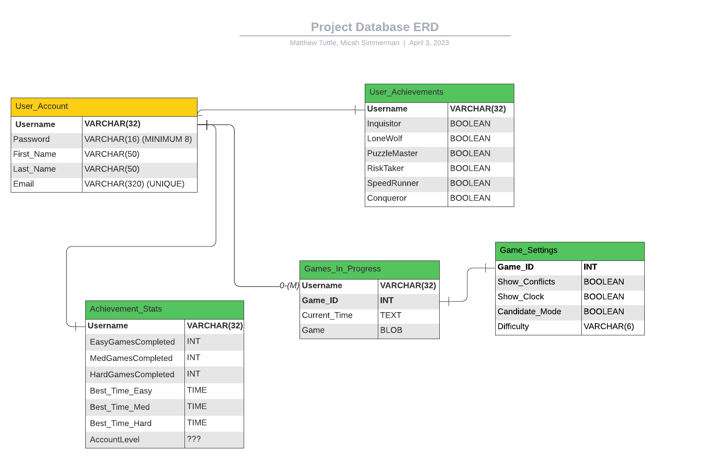

Instructions:

You will create a list of descriptions for tables and functions being created for the project.
You must add a file SQL_TESTING.md to your repository and provide the following for each table (at least 3 tables):

Table Name
Table Description
For each field of the table, provide name and short description.
List of tests for verifying each table
You must also provide the following (in SQL_TESTING.md)for each data access method (at least one access method for each table or query required to get the data to display):

Name
Description
Parameters
return values
List of tests for verifying each access method
Here is a format that can be used for describing each test:

            Use case name
                Verify login with valid user name and password
            Description
                Test the Google login page
            Pre-conditions
                User has valid user name and password
            Test steps
                1. Navigate to login page
                2. Provide valid user name
                3. Provide valid password
                4. Click login button
            Expected result
                User should be able to login
            Actual result
                User is navigated to dashboard with successful login
            Status (Pass/Fail)
                Pass
            Notes
                N/A
            Post-conditions
                User is validated with database and successfully signed into their account.
                The account session details are logged in database. 
                
                
----------------------------------------------------------------------------------------------------------
Potential ERD - https://lucid.app/lucidchart/3d3e38d0-96ce-46d4-a9d2-875a429e5f47/edit?viewport_loc=51%2C-43%2C3072%2C1577%2C0_0&invitationId=inv_8d986d0b-7302-4dbf-a142-bce282110cbb

JoinID:
WGL R4C

<p align="center">
 
</p>

## User_Account Table ##
### 'User_Account' Table Description ###

    Name: 
        User_Account
    Description:
        User_Account holds user data tuples containing the attributes: 'Username', 'Password', 'First_Name', 'Last_Name', and 'Email'. 
        User_Account will be populated via a form submission on the Create Account page.
        Username and Password are stored and verified in this table to grant the users with access to the rest of the application.
    Field Descriptions:
        Username, VARCHAR(32) - Primary Key
        Password, VARCHAR(16)
        First_Name, VARCHAR(50)
        Last_Name, VARCHAR(50)
        Email, VARCHAR(320) - UNIQUE
    Tests for Table Verification:
        (see below)
#### 'User_Account' Test 1 Description ####

        User_Account Test 1: Insertion of a valid record.
        Use case name:
            "Valid Insert"
        Description:
            Insert a valid record, then retrieve the record(s) to verify the table works as intended.
        Pre-conditions
            The User_Account table must exist.
            User_Account table constraints must be in place.
            Inserted data must agree with the table constraints.
        Test steps
            1. Create the User_Account table (if it does not already exist).
            2. Insert a tuple of valid test data.
            3. '''SELECT * FROM User_Account''' to view the data and verify that the record has been inserted.
        Expected result
            The inserted tuple should be clearly visible from the result of the SELECT query.
        Actual result
            TBD
        Status (Pass/Fail)
            TBD
        Notes
            None.
        Post-conditions
            Tuple exists in the User_Account table.
#### 'User_Account' Test 2 Description ####

        User_Account Test 2: Insertion of a duplicate record.
        Use case name:
            "Duplicate Record Insert"
        Description:
            Inserting a duplicate record into the User_Account table should fail.
        Pre-conditions:
            The User_Account table must exist.
            User_Account table constraints must be in place.
            Inserted record must already exist in the User_Account table.
        Test steps:
            1. Insert a valid tuple into the User_Account table.
            2. Re-insert the tuple from step one into the User_Account table.
            3. Observe the result.
        Expected result:
            An error should occur, citing a violation of the User_Account table constraints.
        Actual result:
            TBD
        Status (Pass/Fail):
            TBD
        Notes:
            Insertion of a duplicate record will be rejected by the database API, which may result in unexpected application behavior. As a result, it is probably best to SELECT COUNT the matching records first, then evaluate the results and perform the correct action. If this result is not 0, the record should be refused by the route performing the verification, NOT by the database API itself. 
        Post-conditions:
            None.
#### 'User_Account' Test 3 Description ####

        <Name> Test 3: Insertion of a record with a duplicate email address.
        Use case name:
            "Existing Email Insert"
        Description:
            Each account must contain a unique email address. Attempting to create a second account with an existing email address must fail.
        Pre-conditions
            The User_Account table must exist.
            User_Account table constraints must be in place.
            The test record should mimic an attempt to create an account with an existing email address.
        Test steps
            1. Insert a valid record, or choose a valid record from User_Account.
            2. Create a test record containing an existing email address, all other attributes should be valid.
            3. Insert the record from step 2.
            4. Observe the result.
        Expected result
            The insertion should fail based on the UNIQUE attribute constraint placed on "Email".
        Actual result
            TBD
        Status (Pass/Fail)
            TBD
        Notes
            As mentioned before, we should not place undue strain on the API. If necessary, submit a query to gather information about whether the email adress exists inside the User_Account table and then handle the user's request based on this information.
        Post-conditions
            None.

### 'User_Account' Access Method Descriptions ###

#### Method 1: The 'Create_User_Account' Access Method ####

    Name: 
        'Create_User_Account'
    Description:
        Create_User_Account inserts a tuple of new user data into the User_Account table when the user fills in the Create Account form with valid information and clicks the submit button.
    Parameters:
        Username, Password, First_Name, Last_Name, and Email
    return values:  
        Redirect to the Login page.
    List of tests for verifying each access method: 
        'Create_User_Account' Test 1:
            Use case name:
                "Valid Account Creation"
            Description:
                Verify that entering valid form data into the "Create Account" page will produce a new record in the User_Account table, such that this data can be accessed by alternative routes.
            Pre-conditions:
                The User_Account table must exist with the given table constraints.
                The Username test instance must not exist in User_Account.
                The Email test instance must not exist in User_Account.
                Password, First_Name, and Last_Name must be entered as well. 
            Test steps:
                1. Navigate to 'Create an Account' page
                2. Provide a valid username
                3. Provide a password
                4. Provide a first name
                5. Provide a last name
                6. Provide a unique email address
                7. Click the 'Create Account' button
            Expected result:
                A tuple should appear in User_Account describing the new user including his/her login credentials. 
                User should be directed to the 'Login' page after successful registration.
            Actual result:
                TBD
            Status (Pass/Fail):
                TBD
            Notes:
                Since the user must create an account to possess valid login credentials, it makes sense to perform this test before
                testing the User_Account table Login page interaction(s) (next).
            Post-conditions:
                Create Account record must exist and persist in the User_Account table.

#### Method 2: The 'Login_User' Access Method ####

    Name: 
        'Login_User'
    Description:
        The Login_User access method should verify that the user's login credentials exist in the User_Account table and, if so, 
        direct the user to the game page.
    Parameters:
        Username, Password
    return values:  
        None.
    List of tests for verifying each access method: 
        Login_User Test 1:
        Use case name:
            Verify login credentials via User_Account table query.
        Description:
            Verify that a user with valid login credentials is granted access to the rest of the application. 
        Pre-conditions:
            The user must be registered via the 'Create Account' page, and must provide valid login credentials.
        Test steps:
            1. Navigate to the Login page
            2. Provide valid user name
            3. Provide valid password
            4. Click 'Sign In' button
        Expected result:
            The Username and Password should be verified and the user should be directed to the Game page.
        Actual result:
            TBD
        Status (Pass/Fail):
            TBD
        Notes:
            None
        Post-conditions:
            User is directed to the game page.

     
### Table 2 ###
Table Name: Statistics

Table Description:
    Holds account statistics for calculating achievements and displaying for users
    
Fields:
    AccountName - Primary and Foriegn Key
    EasyGamesCompleted
    MedGamesCompleted
    EasyTime
    MedTime
    HardTime
    AccountLevel
    
Tests:
    /* todo */
    
Access Methods:
    getStats - return all fields for display
        '''
        Name
        Description
        Parameters
        return values
        List of tests for verifying each access method
        '''
    
    calcAchievements - update Achievements table based on current account stats
        '''
        Name
        Description
        Parameters
        return values
        List of tests for verifying each access method
        '''
        
### Table 3 ###

Table Name: Achievements

Table Description:
   * Holds flags for user achievements
    
Fields:
   * Username, BOOLEAN - Primary and Foriegn Key
   * Inquisitor, BOOLEAN - flag if user has used more than 5 hints in a game
   * LoneWolf, BOOLEAN- flag if user has completed a puzzle without using hints
   * PuzzleMaster, BOOLEAN - flag if user account has reached max level
   * RiskTaker, BOOLEAN - flag if user has completed 3 hard puzzles
   * SpeedRunner, BOOLEAN - flag if user has completed a hard puzzle in less than 10 minutes
   * Conqueror, BOOLEAN - flag if user has completed a puzzle of each difficulty
    
Tests: INTERACTION WITH THE 'ACHIEVEMENTS' PAGE
   * Use case name 
       * Verify that a user's achievements are unlocked when completing challenges 
   * Description
       * Test that icons are revealed when criteria is met 
   * Pre-conditions 
       * User must have an active account on the webpage 
   * Tests
       * Test 1: Inquisitor
             * Navigate to the Main Page 
             * Start a new game 
             * Click the 'hint' button 5 times 
             * Navigate to the Achievements page
       * Test 2: LoneWolf 
             * Navigate to the Main Page 
             * Start a new game 
             * Finish a puzzle, at any difficulty, without using hints
             * Navigate to the Achievements page 
       * Test 3: PuzzleMaster 
             * Navigate to the user-account 
             * Set user level to max
             * Navigate to the Achievements page
       * Test 4: RiskTaker 
             * Navigate to the Main Page
             * Start a new game 
             * Complete three puzzles on Hard 
             * Navigate to the Achievements page 
       * Test 5: SpeedRunner 
             * Navigate to the Main Page
             * Start a new game 
             * Complete a Hard Puzzle in less than 10 minutes 
             * Navigate to the Achievements page
       * Test 6: Conqueror 
             * Navigate to the Main Page 
             * Start a new game 
             * Complete a puzzle at each difficulty 
             * Navigate to the Achievements page
    * Expected Result
        * The specific badge icons are displayed for each unlockable achievement
        * None of the badges should be locked 
    * Actual Result
        * TBD
    * Status (Pass/Fail)
        * TBD 
    * Notes 
        * Earning a badge should stay permanently flagged unless user resets awards 
    * Post-Conditions 
        * Badges are unlocked as user meets specific criterias for challenges 
        * User is notified when they have unlocked a badge 
Access Methods:
Access Methods:
    getAchievements - return all fields, use for displaying achievements
        '''
        Name
        Description
        Parameters
        return values
        List of tests for verifying each access method
        '''
        
### Table 4  ###

#### Table Information

* Table Name: `GameSettings`
* Table Description: Holds the settings options for a Sudoku game instance
instance
* Fields:
  * `GameID`: Primary and Foreign Key, INT, unique identifier for a Sudoku game instance
  * `ShowConflicts`: BOOLEAN, if true, highlight conflicting entires   
  * `ShowClock`: BOOLEAN, if true, display timer on game board
  * `CandidateMode`: BOOLEAN, if true, automatically display candidates in empty fields
  * `Difficulty`: VARCHAR(6), represents the difficulty level of the game

* Tests:
    1. Add a new entry with valid values for all fields
    2. Update an existing entry with valid values for all fields
    3. Retrieve an existing entry by `GameID`
    4. Delete an existing entry by `GameID`
    5. Add a new entry with an invalid `GameID` (e.g., contains more than `MAX` number of characters)

#### Data Access Methods

* Name: `getSettings`
* Description: Retrieves all fields from the `Settings` table for a given `GameID`
* Parameters: `GameID` (VARCHAR)
* Return values: All fields for the given `GameID`

* Tests:

    ```
      Use case name
          Verify getSettings when a user returns to an in-progress Sudoku game
      Description
          Test the getSettings function when a user returns to an in-progress Sudoku game
      Pre-conditions
          GameID is valid, and the Settings table has an entry for that GameID, which corresponds to an in-progress Sudoku game
      Test steps
          1. Call the getSettings function with the valid GameID
      Expected result
          The function should return all fields for the given GameID
      Actual result
          All fields for the given GameID are returned
      Status (Pass/Fail)
          Pass
      Notes
          N/A
      Post-conditions
          The correct settings for the given GameID are retrieved from the Settings table, which allows the user to continue the game with their previous settings

    ```

* Name: `updateSettings` 
* Description: Updates the settings for a given `GameID`
* Parameters:
  * `GameID` INT
  * `ShowConflicts` BOOLEAN
  * `ShowClock` BOOLEAN
  * `CandidateMode` BOOLEAN
  * `Difficulty` VARCHAR(6)
* Return values: `None` (changes are made directly in the database)

* Tests:

    ```
      Use case name
          Verify updateSettings when a user changes settings while solving a Sudoku game
      Description
          Test the updateSettings function when a user changes the settings while solving a Sudoku game
      Pre-conditions
          GameID is valid, and the Settings table has an entry for that GameID, which corresponds to an in-progress Sudoku game
      Test steps
          1. Call the updateSettings function with a valid GameID and valid settings values
          2. Retrieve the updated settings for the given GameID using the getSettings function
      Expected result
          The function should update the settings for the given GameID, and the retrieved settings should match the updated values. The updated settings should be reflected in the in-progress Sudoku game
      Actual result
          The settings for the given GameID are updated, and the retrieved settings match the updated values. The updated settings are reflected in the in-progress Sudoku game
      Status (Pass/Fail)
          Pass
      Notes
          N/A
      Post-conditions
          The settings for the given GameID are successfully updated in the Settings table, which allows to user to continue solving the Sudoku game with the updated settings

    ```

* Name: `createSettings`
* Description: Creates a new settings entry for a given GameID using default values
* Parameters: `GameID` INT
* Return values: `None` (a new entry is created in the database)

* Tests:

    ```
      Use case name
          Verify createSettings when a user starts a new Sudoku game
      Description
          Test the createSettings function when a user starts a new Sudoku game
      Pre-conditions
          A new GameID is generated for the new Sudoku game, and the Settings table does not have an entry for that GameID
      Test steps
          1. Call the createSettings function with the new GameID
          2. Retrieve the created settings for the given GameID using the getSettings function
      Expected result
          The function should create a new settings entry with default values for the new GameID, and the retrieved settings should match the default values. The default settings should be applied to the new Sudoku game
      Actual result
          A new settings entry is created with default values for the new GameID, and the retrieved settings match the default values. The default settings are applied to the new Sudoku game
      Status (Pass/Fail)
          Pass
      Notes
          N/A
      Post-conditions
          A new settings entry with default values is successfully created in the Settings table for the new GameID, which allows the user to start a new Sudoku game with default settings
    ```

### Table 5 ###

Table Name: Games

Table Description:
    Holds saved games for users
    
Fields:
    GameID - Primary key generated for game
    AccountName - Foriegn Key
    GameState - string with data for game state
    
Tests:
    /* todo */
    
Access Methods:
    getSettings - return all fields, use for displaying game board and settings page
        '''
        Name
        Description
        Parameters
        return values
        List of tests for verifying each access method
