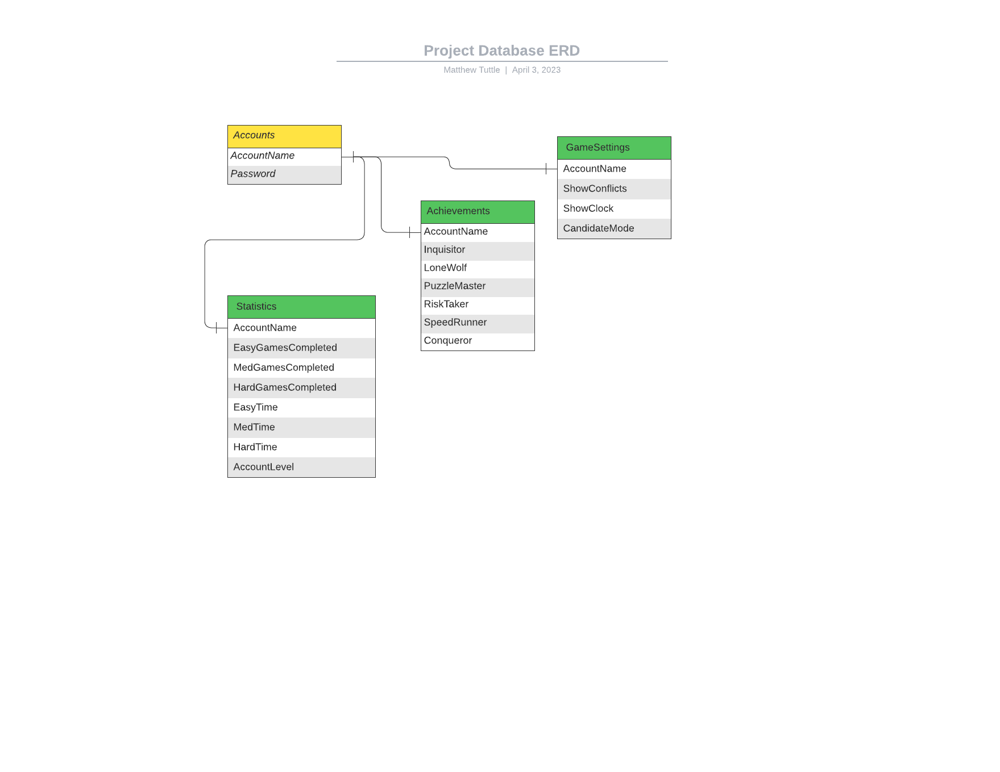

Instructions:

You will create a list of descriptions for tables and functions being created for the project.
You must add a file SQL_TESTING.md to your repository and provide the following for each table (at least 3 tables):

Table Name
Table Description
For each field of the table, provide name and short description.
List of tests for verifying each table
You must also provide the following (in SQL_TESTING.md)for each data access method (at least one access method for each table or query required to get the data to display):

Name
Description
Parameters
return values
List of tests for verifying each access method
Here is a format that can be used for describing each test:

            Use case name
                Verify login with valid user name and password
            Description
                Test the Google login page
            Pre-conditions
                User has valid user name and password
            Test steps
                1. Navigate to login page
                2. Provide valid user name
                3. Provide valid password
                4. Click login button
            Expected result
                User should be able to login
            Actual result
                User is navigated to dashboard with successful login
            Status (Pass/Fail)
                Pass
            Notes
                N/A
            Post-conditions
                User is validated with database and successfully signed into their account.
                The account session details are logged in database. 
                
                
----------------------------------------------------------------------------------------------------------
Potential ERD - https://lucid.app/lucidchart/3d3e38d0-96ce-46d4-a9d2-875a429e5f47/edit?viewport_loc=51%2C-43%2C3072%2C1577%2C0_0&invitationId=inv_8d986d0b-7302-4dbf-a142-bce282110cbb

JoinID:
WGL R4C

 

### Table 1 ###
Table Name: User_Account

Table Description:
    Holds unique account names and passwords used to verify user login credentials.

Fields:
    Username, VARCHAR(32) - Primary Key
    Password, VARCHAR(16)
    First_Name, VARCHAR(50)
    Last_Name, VARCHAR(50)
    Email, VARCHAR(320)

Tests:
    Use case name
        Verify that a new user can create a User_Account tuple by interacting with the Create Account application page.
    Description
        Test that form data is being entered into the User_Account table from the "Create an Account" page.
    Pre-conditions
        User must provide a valid Username that does not already exist in the User_Account table, password, First_Name,
        Last_Name, and Email. Note: Email address should be unique for each User_Account tuple.
    Test steps
        1. Navigate to Create an Account page
        2. Provide valid user name
        3. Provide valid password
        4. Provide a first name
        5. Provide a last name
        6. Provide an email address
        4. Click Create Account button
    Expected result
        Subtest 1:
            If the username and Email do not exist in the User_Account table, the user should be directed to the Login page.
        Subtest 2:
            If the username exists in the User_Account table but the email does not, user should be advised to pick a different username.
        Subtest 3:
            If the user's email exists in the User_Account table, a pop-up message should appear saying that an account already exists 
            with that email address.
    Actual result
        TBD
    Status (Pass/Fail)
        TBD
    Notes
        Since the user must create an account to possess valid login credentials, it would make sense to test the 
        functionality of the Create Account page before conducting this test.
    Post-conditions
        User is validated with database and successfully signed into their account.
        The account session details are logged in database. 
    
Access Methods:

        Name: Create_Account_Table
        Description:  Add new AccountName/Password to table.
        Parameters:  Generate once using Admin_credentials?
        return values:  None. Results in Account table creation.
        List of tests for verifying each access method: TO-DO

        Name: Create_Account
        Description: Add new AccountName/Password to table
        Parameters: 
        Return values: 
        List of tests for verifying each access method
        
        
        Login - Check input data against table AccountName/Password
        '''
        Name
        Description
        Parameters
        return values
        List of tests for verifying each access method
        '''
    

     

### Table 2 ###
Table Name: Statistics

Table Description:
    Holds account statistics for calculating achievements and displaying for users
    
Fields:
    AccountName - Primary and Foriegn Key
    EasyGamesCompleted
    MedGamesCompleted
    EasyTime
    MedTime
    HardTime
    AccountLevel
    
Tests:
    /* todo */
    
Access Methods:
    getStats - return all fields for display
        '''
        Name
        Description
        Parameters
        return values
        List of tests for verifying each access method
        '''
    
    calcAchievements - update Achievements table based on current account stats
        '''
        Name
        Description
        Parameters
        return values
        List of tests for verifying each access method
        '''
        
### Table 3 ###

Table Name: Achievements

Table Description:
    Holds flags for user achievments
    
Fields:
    AccountName - Primary and Foriegn Key
    Inquisitor - flag if user has used more than 5 hints in a game
    LoneWolf - flag if user has completed a puzzle without using hints
    PuzzleMaster - flag if user account has reached max level
    RiskTaker - flag if user has completed 3 hard puzzles
    SpeedRunner - flag if user has completed a hard puzzle in less than 10 minutes
    Conqueror - flag if user has completed a puzzle of each difficulty
    
Tests:
    /* todo */
    
Access Methods:
    getAchievements - return all fields, use for displaying achievements
        '''
        Name
        Description
        Parameters
        return values
        List of tests for verifying each access method
        '''
        
### Table 4 ###

Table Name: Settings

Table Description:
    Holds settings options for user
    
Fields:
    AccountName - Primary and Foriegn Key
    ShowConflicts - Boolean, if true highlight conflicts if entered
    ShowClock - Boolean, if true display timer on game board
    CandidateMode - Boolean, if true automatically dispaly candidates in empty fields
    
Tests:
    /* todo */
    
Access Methods:
    getSettings - return all fields, use for displaying game board and settings page
        '''
        Name
        Description
        Parameters
        return values
        List of tests for verifying each access method
        '''

### Table 5 ###

Table Name: Games

Table Description:
    Holds saved games for users
    
Fields:
    GameID - Primary key generated for game
    AccountName - Foriegn Key
    GameState - string with data for game state
    
Tests:
    /* todo */
    
Access Methods:
    getSettings - return all fields, use for displaying game board and settings page
        '''
        Name
        Description
        Parameters
        return values
        List of tests for verifying each access method