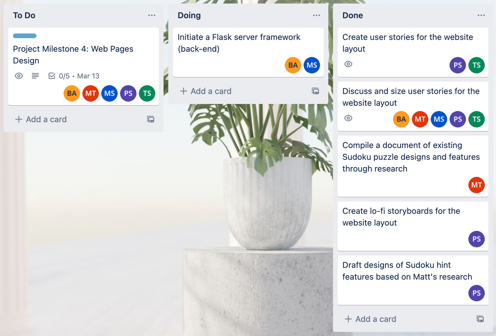
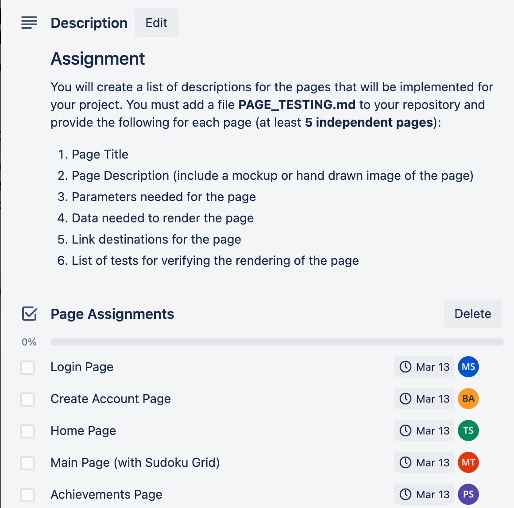

## Weekly Status ##

### Week 1: February 20-26 ###

* Completed
  * Matt: Put together document with sudoku game and website design examples in 'UI_UX_Design_Resources.txt.'
  * Micah: Created resource documents UI_UX_Design_Resources.txt and sudoku_resources.txt, populated them with public repository and weblink resources. 
  * Ben: Looked at different current implementations of sudoku
  * Paul: finished the first draft of the main page 
  * Tory: set up `WEEKLY_STATUS.md` and `images` folder for progress tracking (notes and screenshots); created mid-fi wireframes for Main Page and Login Page based on Paul's lo-fi mockups

* In Progress
  * Matt: Researching sudoku gameplay code and solver algorithms
  * Micah: Working on adapting the tools from Lab 6 to produce a working RESTful API framework to act as a starting foundation for the project. 
  * Ben: Creating interesting pedagogical features for sudoku
  * Paul: Mocking up the design for the; Main Page, feedback page, progress meter page, awards page, difficulty meter, and the setting option page. 
  * Tory: collaborate with Paul on website design; currently polishing up Main Page, Login Page, and Progress Meter Page 

* To Do
  * Matt: Make a simple javascript implementation of sudoku or get running open source implementation
  * Micah: Adapt Lab 6 resources to provide a RESTful development framework for the team to work with. Likewise, plans to adapt and discuss Test Driven Design resources from the reading and labs to help the team formulate a plan for TDD efforts in the coming weeks. 
  * Ben: Decide how to implement learning tools 
  * Paul: Story Board the design of each page on the website.
  * Tory: create mid-fi wireframes for the remaining pages so that designs can be updated easily by other team members

  

### Week 2: February 27 - March 5 ###

* Completed
  * Matt: Did additional research into javascript implementations, no final product completed yet
  * Micah: created an initial flask server set up and started adding files to the templates folder for html templates and future css style sheets. 
  * Ben: Turned in project milestone 
  * Paul: finished story boarding the rough drafts of the; main page, show my mistakes page, candidate mode page, highlight next move page, award page and difficulty page.
  * Tory: finished mid-fi wireframes and presented designs to team; updated Trello board layout and assigned tasks

* In Progress
  * Matt: Supply Tory and Paul with direction for main page wireframes
  * Micah: Creating a graph to demonstrate the planned flow of the team web application and elucidate form functionalities.
  * Ben: Turned in Milestone but still don't have push permissions 
  * Paul: work with Tory to tweak wireframes (with input from other team members) 
  * Tory: work with Paul to tweak wireframes (with input from other team members)

* To Do
  * Matt: Continue work on js sudoku implementation
  * Micah: Create a user-experience graph using the mock-up pages designed by Tory and Paul. Expecting to complete this effort circa Thursday 14Mar2023.   
  * Ben: Figure out GitHub
  * Paul: draft Home Page and Achievements Page for Project Milestone 4
  * Tory: draft Home Page and Achievements Page for Project Milestone 4

  
  

### Week 3: March 6 - March 12 ###

* Completed 
    * Matt: ...
    * Micah: Created a set of simple Flask HTML and CSS template documents. Attempted pair-programming with Ben on Sunday, but spent that time helping Ben get push access to the group repository instead. 
    * Ben: Finally achieved Push permission for group repository 
    * Paul: 
       * Summitted rough draft of Achievement Page info for Project Milestone 4. Awaiting peer review.
       * Finished final draft of webpage design 
       * Approval for final draft of webpage design given by group 
    * Tory: submitted draft of Home Page information for Project Milestone 4 (awaiting peer review) and finished final draft of webpage design
    
* In Progress 
    * Matt: ...
    * Micah: Communicating with team about the next steps of development. Learned about Tory and Paul's recent breakthroughs with the 'moqups' design tools. 
    * Ben: Understan the next stages of development and how to contribute 
    * Paul: Establishing an understanding of the information required for each bullet point in Project Milestone 4
    * Tory: consider options for implementing page designs

* To Do 
    * Matt: ...
    * Micah: Get access to mock-ups created by Tory and Paul, and start creating a user experience diagram this week.
    * Ben: Fill out Registraion Page for Milestone Four 
    * Paul: Fill out Achievements Page for Project Milestone 4
    * Tory: work with Paul on implementing the page designs 

### Week 4: March 13 - March 19 ###

* Completed 
    * Matt: ...
    * Micah: Gained access to "moqups" info-visualization tools, began creating a user experience flowchart. Added "wireframe_user_experience_graph_version01_01" to the TEAM_RESOURCES folder.
    * Ben: Registration and Login Page for Project Milestone 4 
    * Paul: ...
    * Tory: ...
    
* In Progress 
    * Matt: ...
    * Micah: Gather feedback from team members to develop the user experience flowchart and elucidate the desired application behaviors.
    * Ben: FLASK framework for backend 
    * Paul: ...
    * Tory: ...

* To Do 
    * Matt: ...
    * Micah: ...
    * Ben: FLASK framework, look into databases for user credentials 
    * Paul: Begin using HTML to design the layout of the webpage based on the story-boards that were approved by the group.
    * Tory: ...
